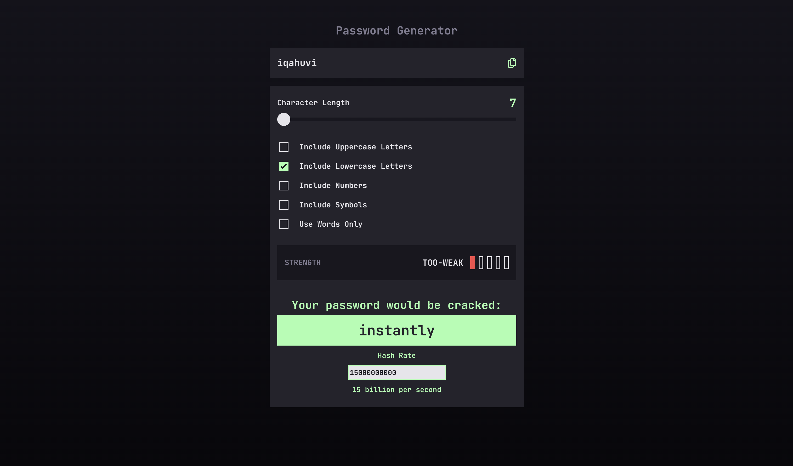
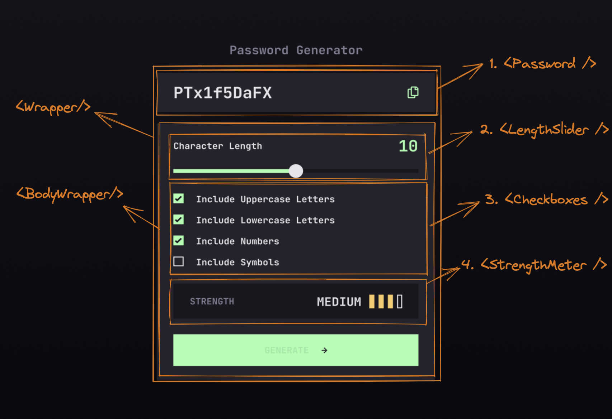

# Password generator

## Table of contents

- [Overview](#overview)
  - [The challenge](#the-challenge)
  - [Screenshot](#screenshot)
  - [Links](#links)
- [My process](#my-process)
  - [Built with](#built-with)
  - [What I learned](#what-i-learned)
  - [Continued development of this project](#continued-development)
  - [Useful resources](#useful-resources)
- [Author](#author)
- [Acknowledgments](#acknowledgments)

## Overview

### The challenge

Users should be able to:

- Generate a password based on the selected inclusion options
- Copy the generated password to the computer's clipboard
- See a strength rating for their generated password
- View the optimal layout for the interface depending on their device's screen size
- See hover and focus states for all interactive elements on the page

### Screenshot



### Links

- Live Site URL: [Password Generator](https://password-generator-ajsaule.vercel.app)

## My process

I first decided to break down the design with some planning using Excalidraw which I will attach some screenshots to display my planning process, I broke down into sections that allowed me to better understand what needed to be built in the end.



### Built with

- Semantic HTML5 markup
- SASS (SCSS) - Syntactically Awesome Style Sheets
- Flexbox
- Mobile-first workflow
- [React](https://reactjs.org/) - JS library
- [TypeScript](https://www.typescriptlang.org/)

### What I learned

Firstly that you can use `Math.random()` and multiply it by the length of an array to generate a randomly selected array index. Also I learned that you can create an array with with the array constructor and map over that passing a function reference to that map method to execute and return a 1:1 copy of that array but with the output of the given function that was passed to the method. The relevant code is below.

```js
const characterGenerator = (): string => {
  const finalArray = characterFactory(
    upperCaseChecked,
    lowerCaseChecked,
    numbersChecked,
    symbolsChecked
  );
  return finalArray[Math.floor(Math.random() * finalArray.length)];
};

const wordGenerator = () => {
  return memorableList[Math.floor(Math.random() * memorableList.length)];
};

const passwordGenerator = (pwdLength: Number): string => {
  if (pwdLength >= 7) {
    const passwordString = [...Array(parseInt(pwdLength))]
      .map(characterGenerator)
      .join('');
    return passwordString;
  } else {
    const passwordString = [...Array(parseInt(pwdLength))]
      .map(wordGenerator)
      .join(passwordDelimiter);
    return passwordString;
  }
};
```

Another interesting insight was using the `use-debounce` package, that was a hook coming from the community that allowed me to delay a function from running again for a certain period of time, I was using this with a `useEffect` that was listening for window re-size changes, it helped significantly. One more thing I learned here is that clean up functions in `useEffect` hooks help with reducing memory leaks and unwanted behavior of apps.

```js
const handleWindowResize = useDebouncedCallback((): void => {
  setWindowSize(getWindowSize());
}, 1000);

useEffect(() => {
  window.addEventListener('resize', handleWindowResize);

  return () => {
    window.removeEventListener('resize', handleWindowResize);
  };
});
```

Other learnings from this project would be that you can set the background `linear-gradient()` to apply a progressive fill based on some JS variables you pass interpolate into the string that is passed to the inline style on a HTML element:

1. Firstly calculating the percentage for how much of the background the fill will be taking up (I needed to use `// prettier-ignore` here to set some custom brackets in the code)

```js
// prettier-ignore
const sliderBackgroundPercentage =
  wordsChecked && windowSize.innerWidth > 768
    ? `${Math.round(((passwordLength - 1) / (6 - 1)) * 100)}%`
    : wordsChecked && windowSize.innerWidth <= 768
    ? `${Math.round(((passwordLength - 1) / (6 - 1)) * 100)}%`
    : windowSize.innerWidth > 768
    ? `${Math.round(((passwordLength - 7) / (35 - 7)) * 100)}%`
    : `${Math.round(((passwordLength - 7) / (25 - 7)) * 100)}%`;
```

2. Then assigning the inline style the background property with the interpolated sting of percentages so they can dynamically shift when the slider is moved across the progress bar

```html
<input style={{ background: `linear-gradient(to right, #a4ffaf
${sliderBackgroundPercentage}, #18171F ${sliderBackgroundPercentage}`, }} ... />
```

Lastly from this project would be using the resets on different browsers and targeting elements of the out of the box HTML5 tags such as `<input/>`.

```css
input[type='range']::-moz-range-track,
input[type='range']::-ms-track,
input[type='range']::-webkit-slider-runnable-track {
  -ms-appearance: none;
  -moz-appearance: none;
  -webkit-appearance: none;
  border-radius: 0;
  height: 8px;
}
```

### Continued development of this project

Things I would like to implement on this project:

- An input field so the user can input their custom password and check how long it would take for it to be cracked
- A checkbox to select camel case, snake case, pascal case and kebab case is already implemented
- A tooltip when you hover over the time to crack field

### Useful resources

- [Reactiflux Discord](https://www.reactiflux.com/) - This discord is amazing when you get stuck and can't find much help on the internet or SO
- [Stack overflow](https://www.stackoverflow.com/) - Helped me to get unstuck at various phases.

## Author

- Website - [Andrej Saule](https://www.andrejsaule.com)
- Frontend Mentor - [@ajsaule](https://www.frontendmentor.io/profile/ajsaule)
- Twitter - [@ajsaule](https://www.twitter.com/ajsaule)

## Acknowledgments

Big thanks to the devs from Reactiflux Discord that helped me when I got stuck along the way. I learned a lot from all of you, thanks for your volunteered time and patience you had with me.

Thanks to [@cbserra](https://www.frontendmentor.io/profile/cbserra) for providing a redesign for my whole app UI aligning it more toward the previous design that was first given in the figma file. His design can be seen here - [https://codepen.io/cbserra/pen/RwyqpVW](https://codepen.io/cbserra/pen/RwyqpVW). I will at some stage redesign the whole app to make it look in line with his design.
